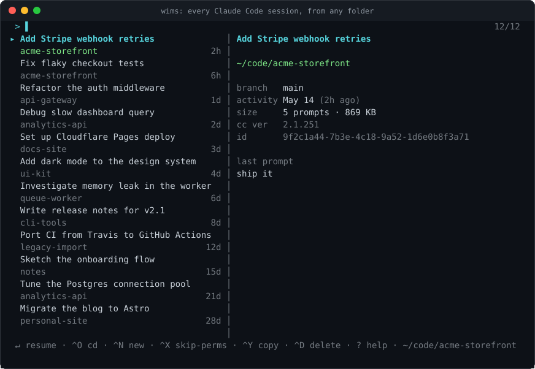
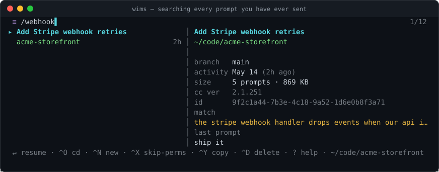

<div align="center">

# wims: where is my session

**Find, preview and resume any Claude Code session, from any folder.**

[](https://github.com/pluginslab/wims/actions/workflows/ci.yml)
[](LICENSE)
[](https://nodejs.org)

</div>

You started a Claude Code session about that webhook bug. It was a good session.
It was also three days and forty folders ago, and `claude --resume` only lists
sessions for the directory you happen to be standing in. So you either remember
where you were, or you lose the thread.

`wims` lists **every** Claude Code session on your machine, wherever you started
it. Search it, preview it, hit enter, and your shell lands *in that folder* with
the conversation resumed.



## Install

Requires **Node 20+**, and the `claude` CLI to actually resume anything.

### From npm

```bash
npm install -g @pluginslab/wims
```

That gives you the `wims-tui` binary. To get the `wims` command that also moves
your shell, install the shell function once:

```bash
mkdir -p ~/.config/wims
wims-tui --print-shim > ~/.config/wims/wims.sh
echo '[ -f ~/.config/wims/wims.sh ] && . ~/.config/wims/wims.sh' >> ~/.zshrc
```

Use `~/.bashrc` for bash. For fish, drop it straight into the autoload
directory and skip the sourcing line entirely:

```bash
wims-tui --print-shim fish > ~/.config/fish/functions/wims.fish
```

Open a new shell and run `wims`.

> Writing the shim to a file is deliberate. `eval "$(wims-tui --print-shim)"` in
> your rc file also works, but it starts Node on every single shell you open.

### From source

```bash
git clone https://github.com/pluginslab/wims.git
cd wims
./install.sh
```

The installer builds the TUI, links `wims-tui` into `~/.local/bin`, and adds the
`wims` function to your shell rc file (zsh, bash and fish are detected). Reverse
all of it with `./install.sh --uninstall`.

## Usage

```
wims                  # every session, newest first
wims webhook          # open with a filter already applied
wims --here           # only sessions started in this directory or below
wims --all            # include one-off sessions (fewer than 2 real prompts)
wims --json           # machine-readable dump, no TUI
wims --yolo           # start with --dangerously-skip-permissions armed
```

### Keys

| Key         | Action                                                    |
| ----------- | --------------------------------------------------------- |
| *type*      | fuzzy filter on session title **and** folder path          |
| `/text`     | full-text search across every prompt you have ever sent    |
| `↑` `↓`     | move the selection                                         |
| `PgUp/PgDn` | jump a page                                                |
| `enter`     | `cd` to the folder **and** resume the session              |
| `ctrl+o`    | `cd` to the folder only, don't start Claude                |
| `ctrl+n`    | `cd` to the folder and start a **new** session             |
| `ctrl+x`    | arm/disarm `--dangerously-skip-permissions`                |
| `ctrl+y`    | copy `cd <dir> && claude --resume <id>` to the clipboard   |
| `ctrl+d`    | delete the transcript (asks first)                         |
| `ctrl+a`    | toggle the hidden one-off sessions                         |
| `?`         | help                                                       |
| `esc`       | clear the filter, or quit when it's already empty          |

### Two kinds of search

Typing filters on the title and the folder path. That covers *"I know roughly
what it was called"*.

Prefixing with `/` answers the harder question, *"I know I asked about X
somewhere"*, by searching the text of every prompt you have ever submitted and
mapping the matches back onto their sessions:



This matters more than it sounds. Claude titles a session after what it was
mostly *about*, which is often not the thing you later go looking for. The
session where you designed a dead-letter table might be titled "Add Stripe
webhook retries". No amount of typing `dead letter` will surface it, because
those words are in neither the title nor the path. Searching what *you* typed
will find it.

### Skipping permission checks

`ctrl+x` arms Claude Code's `--dangerously-skip-permissions` for whatever you
launch next. While it is on, the header carries a red `⚠ SKIP PERMISSIONS` badge
and the footer reads `↵ resume WITHOUT permission checks`. A flag this sharp
should never be armed invisibly.

- Applies to `enter` (resume) and `ctrl+n` (new session).
- Included in the command `ctrl+y` copies.
- Ignored by `ctrl+o`, which only ever `cd`s and never starts Claude.
- **Armed per run.** Quit wims and it is off again. `wims --yolo` starts it on.

Armed, Claude runs every tool call (file writes, shell commands) without asking
first. The shell shim passes through only this one exact flag, never arbitrary
text.

## Why a shell function?

Because no program can change its parent shell's working directory. `wims-tui`
is the binary that draws the list; the `wims` shell function is what runs the
`cd`. That indirection is the whole reason your shell *stays* in the session's
folder after Claude exits.

Without the function, `wims-tui` still works. It launches Claude in the right
folder, but your shell returns to where it started.

## How it works

Claude Code keeps a JSONL transcript per session under
`~/.claude/projects/<encoded-path>/<session-id>.jsonl`, plus a global prompt log
at `~/.claude/history.jsonl`. `wims` reads those, and nothing else.

Three things keep it instant across hundreds of megabytes of transcripts:

- **It never reads the middle of a transcript.** Everything it needs sits at the
  two ends. `cwd`, `gitBranch` and `version` land in the first entry, while
  Claude's own `ai-title` and your `last-prompt` are rewritten near the tail. It
  reads a 64 KB window from each end and skips everything between.
- **Prompt counts come from `history.jsonl`**, which is a few MB and already
  indexed by session, rather than being counted across the transcripts.
- **Results are cached** in `<claude-config>/wims/cache.json`, keyed by each
  file's path, size and mtime. Transcripts are append-only, so only changed files
  are re-read.

On a real machine with 125 sessions and ~330 MB of transcripts, that is ~220 ms
cold and ~130 ms warm.

Titles come from Claude Code's own `ai-title` where one exists, falling back to
your first prompt, then the folder name.

### Privacy

Everything is local. `wims` makes no network calls and only reads inside your
Claude config directory. The one thing it writes outside its own cache is the
transcript deletion behind `ctrl+d`, which asks first. See [SECURITY.md](SECURITY.md).

## Configuration

| Variable            | Meaning                                                          |
| ------------------- | ---------------------------------------------------------------- |
| `CLAUDE_CONFIG_DIR` | Where Claude Code keeps its config. Defaults to `~/.claude`.      |
| `WIMS_BIN_DIR`      | Where `install.sh` links the binary. Defaults to `~/.local/bin`.  |

## Development

```bash
npm install
npm run build
npm test           # builds, then runs the suite
npm run demo       # open wims against invented sessions, not your own
npm run screenshot # regenerate assets/*.svg
```

The test suite drives the real Ink component through `ink-testing-library`:
keystrokes in, rendered frames and emitted actions out. The screenshots are
generated by running the real scanner over a fake config directory, so they
cannot drift from what the tool actually looks like.

See [CONTRIBUTING.md](CONTRIBUTING.md).

## Limitations

- The **fish shim ships but is untested**, written against fish 3.1+ syntax.
  Reports welcome.
- Deleted or moved project folders show a `✗` and refuse to resume, since the
  folder is genuinely gone.
- `history.jsonl` remembers far more sessions than survive as transcripts. Only
  sessions with a transcript can be resumed, so those are what `wims` lists.
- `/` search covers **your prompts**, not Claude's replies. If a topic only ever
  appeared in Claude's output, `/` will not find it.

## License

[MIT](LICENSE)
